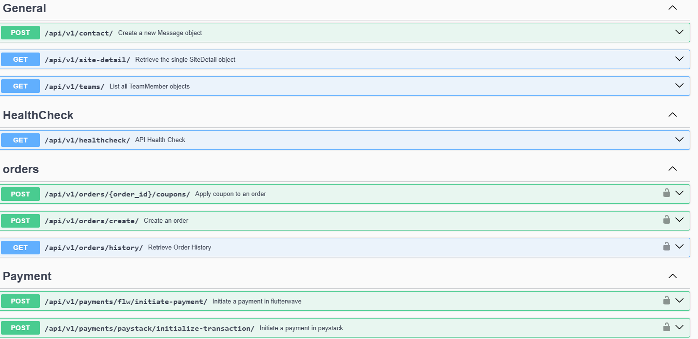

# Clothing store

# Features
* User Authentication and Registration
* Product Management
* Shopping Cart
* Wishlist
* Order Management
* Coupons
* Discounts
* User Profiles
* Reviews and Ratings
* Admin Dashboard

# Tech Stack
* Django Rest Framework
* Postgres
* Docker
* Celery & Redis for asynchronous tasks
  
# How to run locally
* Download this repo or run: 
```bash
    $ git clone repo
```

#### In the root directory:
- Create and activate a virtual environment
- Install all dependencies
```bash
    $ pip install -r requirements.txt
```
OR
```bash
    $ make reqn
```
- Create an `.env` file and copy the contents from the `.env.example` to the file and set the respective values. A postgres database can be created with PG ADMIN(GUI) or psql(on the CLI)

- Make migrations
```bash
    $ python manage.py migrate
```
OR
```bash
    $ make mig
```
- Run Locally
```bash
    $ python manage.py runserver
```
OR
```bash
    $ make serv
```
```bash
    $ python manage.py test apps.app_name.tests
```

**On windows**
```bash
    $ docker run -it --rm --name redis -p 6379:6379 redis
```
```bash
    $ celery -A clothing_store worker -l info --pool=solo
```
```bash
    $ celery -A clothing_store beat -l info
```
```bash
    $ celery -A clothing_store flower --basic-auth=admin:password
```

- Run With Docker
```bash
    $ docker-compose up  
```
OR
```bash
    $ make up  
```
- Run with ngrok
 ```bash
    $   ngrok http 8000
```

## NOTE
* For webhook to work with paystack install ngrok with choco. Follow the installation guide in the resources section. Ensure choco is installed on your system.
* To use the makefile follow these instructions if using Windows, for Linux OS and Mac OS you can google search the procedure
- **Step 1**: Run powershell as administrator
- **Step 2:** Visit chocolatey website
- **Step 3:** choco install make
- Now you can successfully use the make command in your django app, update the Makefile as you wish

## Resources 
* [Ngrok](https://download.ngrok.com/downloads/windows)
* [Docker Best Practices](https://testdriven.io/blog/docker-best-practices/)
* [Production Django Deployments on Heroku](https://testdriven.io/blog/production-django-deployments-on-heroku/)
* [Dockerizing Celery and Django](https://testdriven.io/courses/django-celery/docker/)
* [Dockerizing Django with Postgres, Gunicorn, and Nginx](https://testdriven.io/blog/dockerizing-django-with-postgres-gunicorn-and-nginx/#project-setup)
* [Deploying Django to production](https://developer.mozilla.org/en-US/docs/Learn_web_development/Extensions/Server-side/Django/Deployment#example_hosting_on_railway)
* [Deploy Django on Railway with this coding file](https://www.codingforentrepreneurs.com/blog/deploy-django-on-railway-with-this-dockerfile)
* [Integrating Paystack Payment Gateway Into Your Django Project - Part I](https://willingly.hashnode.dev/integrating-paystack-payment-gateway-with-django)
* [Integrating Paystack Payment Gateway Into Your Django Project - Part II](https://willingly.hashnode.dev/integrating-paystack-payment-gateway-with-django-ii)
* [An opinionated guide to drf-oauth](https://www.circumeo.io/blog/entry/an-opinionated-guide-to-drf-oauth/)
* [Security scanner](https://www.apisec.ai/blog/apisec-the-only-platform-for-automated-api-security-testing)

  
# Home Page
 
 
 
 
 
 
 


 

# Admin dashboard
  
  
  


